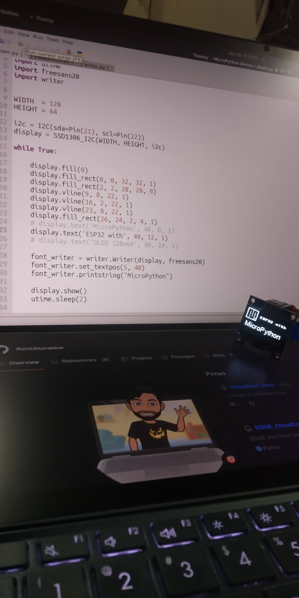

# I2C Graphic LCD

* Copy all the required files to ESP32 or any MicroPython supporting board.
    * ssd1306.py
    * writer.py
    * freesans20.py
    * main.py

------------------------------------------------------------------------

-------------------------------------------------------------------------

Rohit Akurdekar
